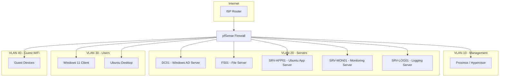

```mermaid

graph TD

subgraph Internet
    A[ISP Router]
end

A --> PF[pfSense Firewall]

subgraph VLAN 10 - Management
    M1[Proxmox / Hypervisor]
end

subgraph VLAN 20 - Servers
    DC[DC01 - Windows AD Server]
    FS[FS01 - File Server]
    APP[SRV-APP01 - Ubuntu App Server]
    MON[SRV-MON01 - Monitoring Server]
    LOG[SRV-LOG01 - Logging Server]
end

subgraph VLAN 30 - Users
    W10[Windows 11 Client]
    UDESK[Ubuntu Desktop]
end

subgraph VLAN 40 - Guest WiFi
    GW1[Guest Devices]
end

PF --> M1
PF --> DC
PF --> FS
PF --> APP
PF --> MON
PF --> LOG
PF --> W10
PF --> UDESK
PF --> GW1

```
