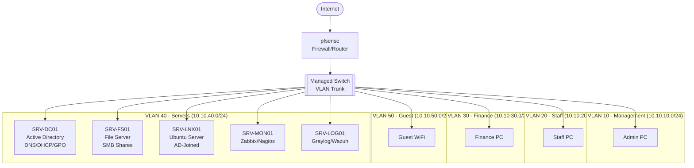

```mermaid
flowchart TD

    INET([Internet])

    PF[pfsense<br>Firewall/Router]

    SWITCH[[Managed Switch<br>VLAN Trunk]]

    INET --> PF --> SWITCH

    %% VLAN Sections
    subgraph VLAN10["VLAN 10 - Management (10.10.10.0/24)"]
        ADMINPC[Admin PC]
    end

    subgraph VLAN20["VLAN 20 - Staff (10.10.20.0/24)"]
        STAFFPC[Staff PC]
    end

    subgraph VLAN30["VLAN 30 - Finance (10.10.30.0/24)"]
        FINPC[Finance PC]
    end

    subgraph VLAN50["VLAN 50 - Guest (10.10.50.0/24)"]
        GUEST[Guest WiFi]
    end

    subgraph VLAN40["VLAN 40 - Servers (10.10.40.0/24)"]
        DC[SRV-DC01<br>Active Directory<br>DNS/DHCP/GPO]
        FS[SRV-FS01<br>File Server<br>SMB Shares]
        LNX[SRV-LNX01<br>Ubuntu Server<br>AD-Joined]
        MON[SRV-MON01<br>Zabbix/Nagios]
        LOG[SRV-LOG01<br>Graylog/Wazuh]
    end

    SWITCH --> ADMINPC
    SWITCH --> STAFFPC
    SWITCH --> FINPC
    SWITCH --> GUEST

    SWITCH --> DC
    SWITCH --> FS
    SWITCH --> LNX
    SWITCH --> MON
    SWITCH --> LOG
```
